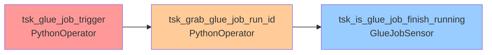

# AWS-Customer-Churn-Project
# Telecom Customer Churn Analysis

**End-to-End ETL Pipeline with AWS Glue, Redshift, and Tableau**

This project demonstrates a complete AWS-based ETL pipeline designed to analyze customer churn for a telecom provider. It covers raw data ingestion, transformation, data warehousing, and business intelligence dashboarding. The goal is to identify churn patterns, segment customer risk levels, and visualize financial risks such as CLTV and monthly revenue loss.


---

## Project Objectives

- **Identify High-Risk Customers**: Segment customers based on churn probability and financial impact
- **Financial Impact Analysis**: Calculate Customer Lifetime Value (CLTV) and revenue at risk
- **Automated Data Processing**: Build scalable ETL pipeline for ongoing churn analysis
- **Self-Service Analytics**: Enable business users to explore churn patterns through interactive dashboards

---

## Architecture Overview

![Architecture Diagram]


### Technology Stack

| Layer | Technology | Purpose |
|-------|------------|---------|
| **Data Storage** | Amazon S3 | Raw data lake storage |
| **Data Cataloging** | AWS Glue Crawler | Schema inference and metadata management |
| **Data Processing** | AWS Glue (PySpark) | ETL transformations and data quality |
| **Data Warehouse** | Amazon Redshift | Analytical data store |
| **Orchestration** | Apache Airflow | Workflow management and job scheduling |
| **Job Monitoring** | AWS Glue Job Sensor | Real-time ETL job status monitoring |
| **Analytics** | Amazon Athena | Ad-hoc querying |
| **Visualization** | Tableau Desktop | Business intelligence dashboards |

### Airflow DAG Workflow



---

## Key Business Metrics

Based on the analysis of **6,400 customers**:

| Metric | Value | Impact |
|--------|-------|--------|
| **High-Risk Customers** | 1,900 (29.7%) | Immediate attention required |
| **Total CLTV at Risk** | $5.29M | Potential revenue loss |
| **Monthly Revenue at Risk** | $93.9K | Ongoing financial impact |
| **Average Churn Rate** | 32.66% | Industry benchmark comparison |

---

## ETL Pipeline Flow

### Apache Airflow DAG Architecture


The pipeline is orchestrated using Apache Airflow with the following task sequence:

```
tsk_glue_job_trigger → tsk_grab_glue_job_run_id → tsk_is_glue_job_finish_running
```

**DAG Tasks:**
- **tsk_glue_job_trigger** (PythonOperator): Initiates AWS Glue job execution
- **tsk_grab_glue_job_run_id** (PythonOperator): Captures job run ID for monitoring
- **tsk_is_glue_job_finish_running** (GlueJobSensor): Monitors job completion status

### AWS Glue Job Flow


The ETL transformation follows this three-stage process:

```
S3 Data Source → Schema Change Transform → Redshift Data Target
```

1. **Data Source (Amazon S3)**
   - Raw customer churn data stored in S3 bucket
   - JSON/CSV files with customer demographics, billing, and service data
   - Automated triggers detect new file arrivals

2. **Transform - Change Schema**
   - PySpark-based data transformations
   - Schema standardization and data type casting
   - Business logic calculations (CLTV, Churn Score, Tenure Groups)
   - Data quality validations and cleansing

3. **Data Target (Amazon Redshift)**
   - Transformed data loaded into analytical data warehouse
   - Optimized table structures for dashboard queries
   - Incremental loading with change data capture

### Detailed ETL Steps

#### 1. **Data Ingestion & Orchestration**
```python
# Airflow DAG Configuration
from airflow import DAG
from airflow.operators.python_operator import PythonOperator
from airflow.contrib.sensors.aws_glue_job_sensor import AwsGlueJobSensor

def trigger_glue_job():
    glue_client = boto3.client('glue')
    response = glue_client.start_job_run(JobName='telecom-churn-etl')
    return response['JobRunId']

dag = DAG(
    'telecom_churn_etl',
    schedule_interval='@daily',
    catchup=False
)
```

#### 2. **Schema Detection & Transformation**
```python
# AWS Glue PySpark Script
from awsglue.transforms import *
from pyspark.sql import functions as F

# Key transformations applied
df = df.withColumn("ChurnFlag", F.when(df["Churn"] == "Yes", 1).otherwise(0))
df = df.withColumn("CLTV", df["MonthlyCharges"] * df["tenure"])
df = df.withColumn("CustomerTenureGroup", 
    F.when(df["tenure"] <= 12, "0-12")
     .when((df["tenure"] > 12) & (df["tenure"] <= 24), "13-24")
     .otherwise("25+"))
df = df.withColumn("ChurnScore", 
    F.when(df["ChurnFlag"] == 1, 100 - (df["tenure"] * 1.5)).otherwise(0))

# Risk segmentation logic
df = df.withColumn("RiskSegment",
    F.when((df["CLTV"] > 2000) & (df["ChurnScore"] > 60), "High-Value, High-Risk")
     .when((df["CLTV"] > 2000) & (df["ChurnScore"] <= 60), "High-Value, Low-Risk")
     .when((df["CLTV"] <= 2000) & (df["ChurnScore"] > 60), "Low-Value, High-Risk")
     .otherwise("Low-Value, Low-Risk"))
```

#### 3. **Data Loading & Quality Checks**
```python
# Redshift connection and data loading
glue_context.write_dynamic_frame.from_options(
    frame=transformed_df,
    connection_type="redshift",
    connection_options={
        "redshiftTmpDir": "s3://temp-bucket/",
        "useConnectionProperties": "true",
        "dbtable": "customer_churn_analysis",
        "connectionName": "redshift-connection"
    }
)
```

---

## Dashboard Features


### 🎛️ Interactive Components

**KPI Cards:**
- Total Customers: 6.4K
- High-Risk Count: 1.9K  
- CLTV at Risk: $5.29M
- Monthly Revenue at Risk: $93.9K

**Visualizations:**
1. **Customer Retention Funnel** - Churn rate by tenure groups
2. **Risk Segmentation Matrix** - CLTV vs Churn Score quadrant analysis
3. **Tenure vs Charges Scatter** - Customer behavior patterns by gender
4. **Payment Method Analysis** - Revenue comparison between churned vs retained customers

**Interactive Filters:**
- Churn Reason
- Geographic Location (City)
- Customer Demographics (Gender)
- Payment Method

---

##  Getting Started

### Prerequisites
```bash
# AWS CLI Configuration
aws configure set aws_access_key_id YOUR_ACCESS_KEY
aws configure set aws_secret_access_key YOUR_SECRET_KEY
aws configure set default.region us-east-1

# Python Dependencies
pip install boto3 pandas pyarrow
```

### 1. Deploy Infrastructure
```bash
# Create S3 bucket
aws s3 mb s3://your-telecom-churn-bucket

# Deploy CloudFormation stack
aws cloudformation create-stack \
  --stack-name telecom-churn-infrastructure \
  --template-body file://infrastructure/cloudformation.yaml \
  --capabilities CAPABILITY_IAM
```

### 2. Upload Sample Data
```bash
# Upload raw data files
aws s3 cp data/raw/ s3://your-telecom-churn-bucket/raw/ --recursive
```

### 3. Run ETL Pipeline
```bash
# Start Airflow scheduler and webserver
airflow scheduler &
airflow webserver -p 8080 &

# Trigger DAG manually (or let it run on schedule)
airflow dags trigger telecom_churn_etl

# Monitor DAG execution
airflow dags state telecom_churn_etl 2024-01-01
```

Alternative: Direct AWS Glue execution
```bash
# Trigger Glue Crawler
aws glue start-crawler --name telecom-churn-crawler

# Execute Glue Job
aws glue start-job-run --job-name telecom-churn-etl-job
```

### 4. Connect Tableau
1. Open Tableau Desktop
2. Connect to Amazon Redshift
3. Server: `your-redshift-cluster.region.redshift.amazonaws.com`
4. Database: `telecom_churn`
5. Import dashboard from `tableau/telecom_churn_dashboard.twb`

---

## Project Structure

```

```

---

## Key Insights Discovered

### Customer Segmentation
- **High-Value, Low-Risk**: 2.1K customers (33%) - Focus on upselling
- **High-Value, High-Risk**: 900 customers (14%) - Immediate retention efforts  
- **Low-Value, High-Risk**: 1K customers (16%) - Cost-effective retention
- **Low-Value, Low-Risk**: 2.4K customers (37%) - Maintain service quality

### Payment Method Impact
- **Electronic Check**: Highest churn rate (45%) - $78.90 avg monthly charges
- **Bank Transfer**: Lowest churn rate (15%) - $76.00 avg monthly charges
- **Credit Card**: Moderate churn (25%) - $76.10 avg monthly charges

### Tenure Analysis
- **0-12 months**: 32.66% churn rate - Critical onboarding period
- **13-24 months**: 7.75% churn rate - Relationship stabilization
- **25+ months**: 15.85% churn rate - Service satisfaction maintenance

---

## Business Recommendations

1. **Immediate Actions**
   - Target 1,900 high-risk customers with retention campaigns
   - Focus on customers using electronic check payments
   - Implement enhanced onboarding for new customers

2. **Strategic Initiatives**
   - Develop loyalty programs for long-tenure customers
   - Investigate service quality issues causing late-stage churn
   - Create personalized pricing strategies based on CLTV segments

3. **Process Improvements**
   - Automate daily churn score calculations
   - Implement real-time alerting for high-risk customer behaviors
   - Establish monthly business review meetings using dashboard insights

